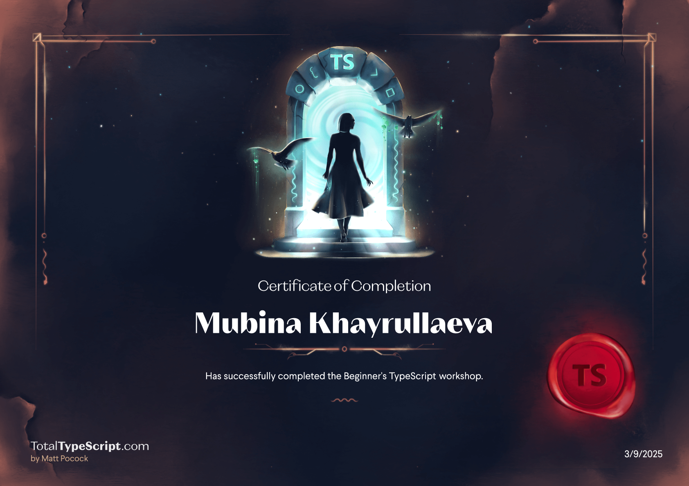

# My TypeScript Journey

## Course 'Beginner's TypeScript'

Here is my result of the course:

Feedback:

- This course follows a unique approach—rather than teaching first and then assigning tasks, it encourages students to explore and attempt solutions on their own first. Only if they struggle to find an answer are they guided through the learning process. This method fosters a sense of responsibility and curiosity, motivating learners to actively seek knowledge and engage more deeply.

## Course 'Learn TypeScript step by step in an interactive environment'

Here is my result of the course:

Feedback:

## Reflections
